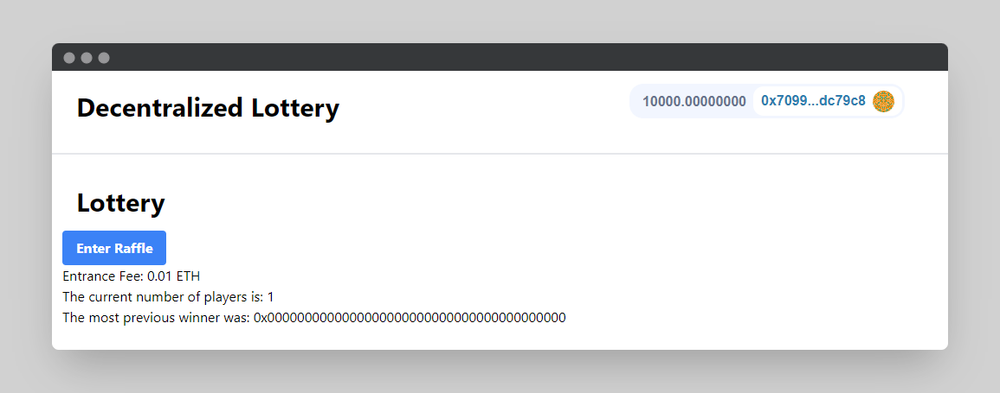

<h1 align="center">
    Hardhat Lottery
</h1>

<br/>

This project is a decentralized lottery where anyone can join and after a set time period a winner will be awarded, all of this is automated.

<hr/>

## 🗎&nbsp; Requirements
- [git](https://git-scm.com/book/en/v2/Getting-Started-Installing-Git)
    You'll know you did it right if you can run `git --version` and you see a response like `git version x.x.x`
    
- [Nodejs](https://nodejs.org/en/)

    You'll know you've installed nodejs right if you can run: `node --version` and get an ouput like: `vx.x.x`
- [Yarn](https://yarnpkg.com/getting-started/install) instead of `npm`
   
   You'll know you've installed yarn right if you can run: `yarn --version` and get an output like: `x.x.x`
   
   You might need to [install it with `npm`](https://classic.yarnpkg.com/lang/en/docs/install/) or `corepack`
   
## 🛠️&nbsp; How to run
- Clone the repo:
    ```
    git clone https://github.com/Meno96/nextjs-smartcontract-lottery.git
    ```
- Enter the directory:
    ```
    cd nextjs-smartcontract-lottery
    ```
- Install packages:
    ```
    yarn
    ```

## 🚀&nbsp; How it's suppose to work?

- Run your local blockchain with the lottery code

  > In a different terminal / command line

  ```
  git clone https://github.com/Meno96/hardhat-smartcontract-lottery.git
  ```
  ```
  cd hardhat-smartcontract-lottery
  ```
  ```
  yarn
  ```
  ```
  yarn hardhat node
  ```

  > You can read more about how to use that repo from its [README.md](https://github.com/Meno96/hardhat-smartcontract-lottery/blob/master/README.md)


- Add hardhat network to your metamask/wallet

  - Get the RPC_URL of your hh node (usually `http://127.0.0.1:8545/`)
  - Go to your wallet and add a new network. [See instructions here.](https://metamask.zendesk.com/hc/en-us/articles/360043227612-How-to-add-a-custom-network-RPC)
    - Network Name: Hardhat-Localhost
    - New RPC URL: http://127.0.0.1:8545/
    - Chain ID: 31337
    - Currency Symbol: ETH (or GO)
    - Block Explorer URL: None

- Ideally, you'd then [import one of the accounts](https://metamask.zendesk.com/hc/en-us/articles/360015489331-How-to-import-an-Account) from hardhat to your wallet/metamask. 

- Run this code

  Back in a different terminal with the code from this repo, run:

  ```
  yarn dev
  ```
- Go to UI and have fun!

 <p align="center">
    
</p>

## 🏴‍☠️&nbsp; Backend
You can find the backend part in [this repository](https://github.com/Meno96/hardhat-smartcontract-lottery.git)

## 📫&nbsp; Have a question? Want to chat? 

[LinkedIn](https://www.linkedin.com/in/daniele-menin/)

[Instagram](https://www.instagram.com/danielemeno96/)
